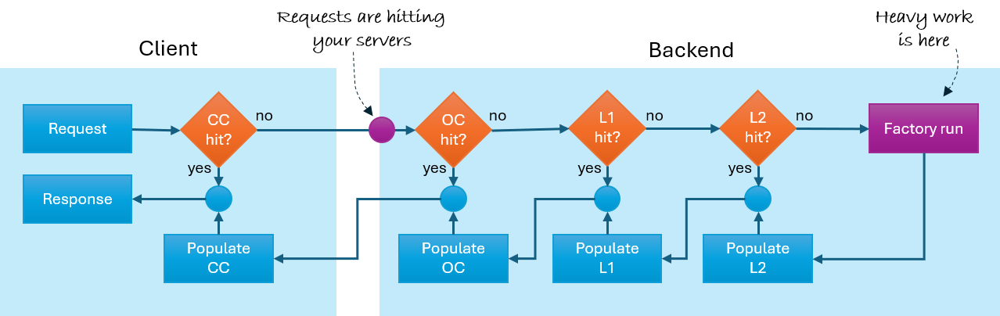

# CacheOrchestrator

[](https://www.nuget.org/packages/CacheOrchestrator/)
[](https://opensource.org/licenses/MIT)
[](https://github.com/amarinsek/CacheOrchestrator/actions)

**CacheOrchestrator** is domain-based caching for ASP.NET Core: define rules once per domain in configuration, then apply them on endpoints with a single attribute or extension. It orchestrates Output Cache (OC), FusionCache (L1/L2), and client Cache-Control (CC) under the same model.

The library targets **.NET 8** and **.NET 10**.



The picture is the path a request can take:

- **Client Cache-Control (CC)** — prevents unnecessary requests from reaching the server.
- **Output Cache (OC)** — serves the stored HTTP response so the endpoint need not run.
- **FusionCache (L1/L2)** — serves the stored object so the factory (your database or service) need not run.

Applications mix these layers: in-memory Output Cache on one service, Redis FusionCache on another, different lifetimes for different kinds of data. If the layers disagree — a long client lifetime beside a short server lifetime, a Version change that never reaches the CDN — one of them undoes the other. CacheOrchestrator holds the mix in one place, the **domain**, so they stay in step.

---

## Why domains

A domain is a named set of cache rules. You declare it in configuration and apply it with `.CacheOutputWithDomain("…")` or `[CacheDomain("…")]`.

Different data wants different rules:

- **Satellite imagery** changes perhaps once a year. Long server and client lifetimes are appropriate.
- **Map tiles** change on a published schedule. Lifetimes stay long, then client `max-age` is shortened as the cutover approaches.
- **Floating car data** ages in minutes. A short lifetime, a memory cache, and a shared Redis store with a backplane keep several instances consistent.
- **Live vehicle positions** age in seconds. FusionCache locking and fail-safe stop a stampede when many callers miss at once.

The endpoint code is the same shape in every case. The domain is what differs.

---

## A one-minute trial

```bash
dotnet run --project samples/CacheOrchestrator.Minimal
```

In another terminal:

```bash
curl -i http://localhost:5290/hello
curl -i http://localhost:5290/hello
```

The first response is an Output Cache miss (the sample waits about 200 ms). The second is a hit. Look at the `X-Cache` header: `output=miss`, then `output=hit`.

Notes for the sample: [samples/CacheOrchestrator.Minimal](samples/CacheOrchestrator.Minimal). For a playground with TTLs, schedule, Redis, and CRUD, see [samples/CacheOrchestrator.Sample](samples/CacheOrchestrator.Sample).

---

## Installation

```bash
dotnet add package CacheOrchestrator
```

Optional packages, when you need them:

- **CacheOrchestrator.Redis** — Redis for Output Cache and for FusionCache L2 / backplane, when instances must share those stores.
- **CacheOrchestrator.Bus** — invalidate, Version, and TTL commands delivered to every instance.
- **CacheOrchestrator.EFCore.Invalidation** — the cache follows your EF Core saves.

---

## A domain and an endpoint

`appsettings.json`:

```json
{
  "Cache": {
    "Namespace": "my-app",
    "OutputCache": { "Provider": "InMemory" },
    "FusionCacheInstances": {
      "default": { "Provider": "InMemory" }
    },
    "Domains": {
      "catalog": {
        "Version": "1",
        "ClientCacheability": "Public",
        "ClientTtlSeconds": 60,
        "OutputCacheTtlSeconds": 120,
        "FusionCacheSoftTtlSeconds": 300
      }
    }
  }
}
```

`Program.cs`:

```csharp
builder.Services.AddCacheOrchestrator(builder.Configuration);

var app = builder.Build();
app.UseCacheOrchestrator();

app.MapGet("/api/products", async (HttpContext http, IDomainFusionCache cache) =>
{
    var data = await cache.GetOrSetAsync(http, LoadProductsAsync);
    return Results.Json(data);
})
.CacheOutputWithDomain("catalog");
```

On a controller, use `[CacheDomain("catalog")]` and inject `IDomainFusionCache` in the same way.

A longer walkthrough is in [docs/getting-started.md](docs/getting-started.md). For the same endpoint written with Output Cache and FusionCache by hand, see [comparison](docs/comparison.md).

---

## What the library covers

**Three layers, one domain.** Output Cache stores the HTTP response. FusionCache stores the object your factory produced. The client receives `Cache-Control` from the same domain settings. [Output Cache](docs/output-cache.md) · [FusionCache](docs/fusion-cache.md)

**A planned cutover.** Change `Version` and old keys are simply left behind. Before a known publish time, [Client Cache Schedule](docs/client-cache-schedule.md) lowers browser and CDN `max-age` so clients revalidate when the new generation appears. Server TTLs are not altered. Snapshot versus CRUD domains: [domain profiles](docs/domain-profiles.md).

**In-memory stores, or Redis.** The core package is self-contained. Redis is a separate package: set `Provider` to `Redis` and call `AddRedisBackend()`. Named Fusion instances may use different Redis connections (for example catalog versus PII). [Backends](docs/backends.md) · [Deployment](docs/deployment.md)

**Several instances.** Shared Fusion data uses Redis L2 and the backplane. In-memory Output Cache on each node, plus the [cluster bus](docs/cluster-bus.md), covers invalidation and runtime Version / TTL when you do not share those stores.

**Seeing what happened.** Responses may carry an `X-Cache` header (domain, hit or miss, schedule phase). There is a meter and an activity source named `CacheOrchestrator`, and a health-check extension. The **Admin API** (`Cache:Admin:Enabled`, `MapCacheOrchestratorAdmin`) exposes stats and operations on each process; it is off by default. The **Admin App** is a separate host that talks to those APIs. [Observability](docs/observability.md) · [Admin](docs/admin.md)

**After EF Core `SaveChanges`.** An optional package maps an entity type to a domain. When the save succeeds, the cache for those rows is cleared. You can also invalidate a domain, a kind, or a single id from your own code. [EF Core](docs/ef-core-invalidation.md) · [Invalidation](docs/invalidation.md)

Authenticated requests skip Output Cache unless you say otherwise. Known tracking query parameters (`utm_*`, `gclid`, and the like) are omitted from cache keys. Custom stores are registered with `ICacheBackendRegistrar`.

---

## Documentation

- [Getting started](docs/getting-started.md) — first endpoint, `X-Cache`, what to read next
- [Documentation index](docs/README.md) — configuration, keys, deployment, architecture
- [FAQ](docs/faq.md) — common mistakes and limits
- [Comparison](docs/comparison.md) — the usual stack versus CacheOrchestrator

Packages on NuGet include XML documentation: [CacheOrchestrator](https://www.nuget.org/packages/CacheOrchestrator/), [Redis](https://www.nuget.org/packages/CacheOrchestrator.Redis/), [Bus](https://www.nuget.org/packages/CacheOrchestrator.Bus/), [EF Core](https://www.nuget.org/packages/CacheOrchestrator.EFCore.Invalidation/).

- [CHANGELOG](CHANGELOG.md)
- [Contributing](CONTRIBUTING.md)
- [Security](SECURITY.md)
- [License](LICENSE.md) (MIT)
