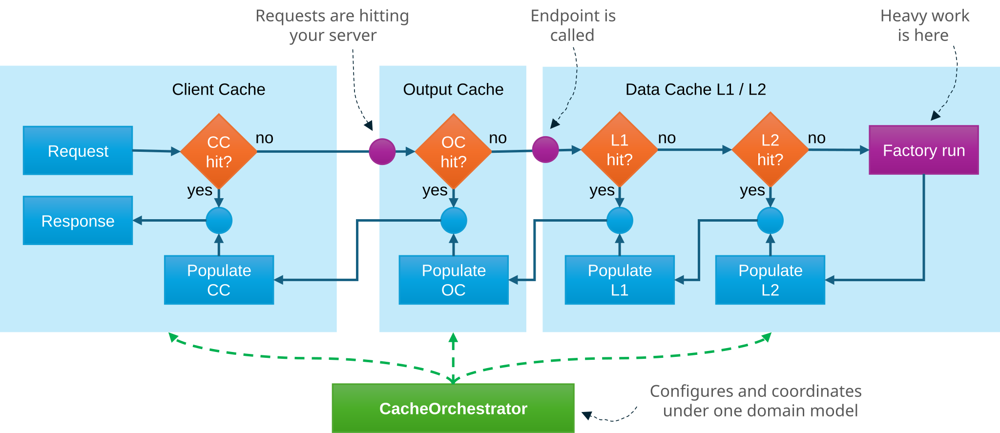

# CacheOrchestrator

[](https://opensource.org/licenses/MIT)
[](https://www.nuget.org/packages/CacheOrchestrator/3.0.0-beta.2)
[](https://github.com/amarinsek/CacheOrchestrator/actions)
[](https://www.nuget.org/packages/CacheOrchestrator/3.0.0-beta.2)

**CacheOrchestrator is a multi-tier cache coordination and synchronized invalidation library for .NET.**

**CacheOrchestrator** unifies the configuration of Output Cache, data cache, and client Cache-Control within a single **domain** model. It ensures seamless coordination and cache invalidation across all layers while significantly reducing boilerplate code.



<br>
The picture is the path a request can take:

- **Client Cache-Control (CC)** — prevents unnecessary requests from reaching the server.
- **Output Cache (OC)** — serves the stored HTTP response so the endpoint need not run.
- **Data cache (L1/L2)** — serves the stored object so the factory (your database or service) need not run.

In real-world applications, these layers are often fragmented - for example, an in-memory Output Cache on one end, a Fusion Cache with Redis L2 data cache on the other, all with varying TTLs. When these layers aren't synchronized, they actively work against each other. CacheOrchestrator unifies these layers within a single **domain** model, keeping lifetimes perfectly in step. 

Cache **invalidation** presents the exact same coordination problem. Clearing the data cache is useless if the Output Cache or the client's browser is still serving a stale HTTP response. CacheOrchestrator solves this by treating invalidation as a single, unified action—when data changes, it is reliably retired across every layer that holds it. 


## Table of Contents
- [Why CacheOrchestrator](#why-cacheorchestrator)
- [Quick start](#quick-start)
- [A one-minute trial](#a-one-minute-trial)
- [Playground topology labs](#playground-topology-labs)
- [Why domains](#why-domains)
- [Features](#features)
- [Packages and applications](#packages-and-applications)
- [Prerelease NOTE](#prerelease-note)
- [Documentation](#documentation)

## Why CacheOrchestrator

- **One domain, three layers.** Output Cache, data cache, and Client Cache-Control share the same policy — less endpoint boilerplate. [comparison](docs/guide/comparison.md)
- **Config, not handlers.** TTLs, topology, and cutovers live in settings; endpoint code stays stable.
- **Coordinated invalidation.** Purge by domain, kind, or id (with entity footprints) across layers — or bump `Version` / use a Client Cache Schedule for planned cutovers.
- **Fits your stack.** Modular packages (e.g. EF Core auto-invalidation), Redis L2, diagnostics, and Admin when you need them.

## Quick start

Install the meta package (AspNetCore + FusionCache):

```bash
dotnet add package CacheOrchestrator --prerelease
```

Configure a domain in `appsettings.json`:

```json
{
  "Cache": {
    "Namespace": "my-app",
    "OutputCache": { "Provider": "InMemory" },
    "DataCacheInstances": { "default": { "Provider": "InMemory" } },
    "Domains": {
      "catalog": {
        "Version": "1",
        "DataCache": { "TtlSeconds": 300 },
        "OutputCache": { "TtlSeconds": 120 },
        "ClientCache": { "Cacheability": "Public", "TtlSeconds": 60 }
      }
    }
  }
}
```

Register the library in your `Program.cs`:

```csharp
builder.Services.AddCacheOrchestrator(builder.Configuration);

var app = builder.Build();
app.UseCacheOrchestrator();
```

Apply the domain to an endpoint. Declare entity identity once on the route (`resourceRouteKey` + `entityKind`); `IDomainDataCache` reuses the same domain policies:

```csharp
app.MapGet("/api/products/{id}", async (HttpContext http, int id, IDomainDataCache cache) =>
{
    // Seamlessly caches across data cache, Output Cache, and applies Cache-Control headers
    var product = await cache.GetOrSetEntityAsync(http, ct => LoadProductAsync(id, ct));
    return product is null ? Results.NotFound() : Results.Json(product);
})
.CacheOutputWithDomain("catalog", entityKind: "products", resourceRouteKey: "id");
```

When that product changes, purge only that entity across Output Cache and data cache:

```csharp
app.MapPut("/api/products/{id}", async (int id, Product updatedProduct, ICacheOrchestratorInvalidator invalidator) =>
{
    await UpdateProductAsync(id, updatedProduct);
    // Invalidates Output Cache and data cache simultaneously
    await invalidator.InvalidateEntityAsync("catalog", "products", id);
    return Results.NoContent();
});
```

> **Note for Controllers & Class Libraries:**
> On a traditional controller, use the `[CacheDomain("catalog", "id", "products")]` attribute and inject `IDomainDataCache` in the same way. Class libraries can depend directly on `ICacheOrchestrator` from the Core package instead, using the exact same domain policies, without needing an `HttpContext`.

> **Tip for Entity Framework Core users:**
> You can eliminate manual invalidation entirely with the `CacheOrchestrator.EFCore.Invalidation` package. After a successful `SaveChangesAsync()`, it automatically invalidates all changed entities.

### Scaling with Redis

If you later want a Redis L2 cache layer, all you need to do is add the package and update your configuration. Your endpoint code stays completely **unchanged**. 

Install Redis package:

```bash
dotnet add package CacheOrchestrator.Redis --prerelease
```

Register the library in your `Program.cs`:
```csharp
builder.Services.AddCacheOrchestrator(builder.Configuration, o => o.AddRedisBackend());
```

Configure Redis in `appsettings.json`:
```json
...
"DataCacheInstances": { "default": { "Provider": "Redis" } },
"Redis": { "Configuration": "localhost:6379" }
...
```


## A one-minute trial

Clone the repository and run the minimal sample:

```bash
dotnet run --project samples/CacheOrchestrator.Minimal
```

In another terminal, test the endpoint:

```bash
curl -i http://localhost:5290/hello
curl -i http://localhost:5290/hello
```

The first response is an Output Cache miss (the sample waits about 200 ms). The second is a hit. Look at the `X-Cache` header: `oc=miss`, then `oc=hit`.

* **Minimal Sample:** [samples/CacheOrchestrator.Minimal](samples/CacheOrchestrator.Minimal) — Notes for the sample above.
* **Full Playground:** [samples/CacheOrchestrator.Sample](samples/CacheOrchestrator.Sample) — Features TTLs, schedule, Redis, and CRUD.


## Playground topology labs

To try **multi-layer layouts** (Admin Console, Prometheus, Redis L2, multiple instances, cluster bus) without wiring Docker yourself, use the playground **topology labs** — one Compose command per stage. 

```bash
docker compose -f samples/CacheOrchestrator.Sample/labs/compose/01-observability.yml up --build
```

Stages climb from a single InMemory playground to a dual Redis + HTTP bus architecture. 

* **Full guide & diagrams:** [samples/CacheOrchestrator.Sample/labs/README.md](samples/CacheOrchestrator.Sample/labs/README.md) — See what each stage teaches and how they evolve.

## Why domains

A domain is a named set of cache rules: lifetimes, which layers to use, and where those layers live. Different data requires a different mix. For example:

- **Satellite imagery** changes perhaps once a year. Long Output Cache and client lifetimes are enough; data cache is optional.
- **Map tiles & batched datasets.** Data like satellite imagery or monthly catalog extracts change on a published schedule. Client lifetimes stay extremely long for months to save bandwidth, but the `max-age` is automatically shortened as the cutover approaches so clients refresh exactly on time. Output Cache can stay in-process.
- **Floating car data** ages in minutes. A short lifetime, in-memory Output Cache, and a shared Redis data cache with a backplane keep several instances consistent.
- **Live vehicle positions** age in seconds. FusionCache locking and fail-safe stop a stampede when many callers miss at once; Output Cache stays off or very short.

The endpoint code is the same shape in every case. The domain is what differs.

Domains are the unit of configuration. Within a domain you can optionally use **entity identity** (`entityKind` + id, and related footprints) so per-entity keys and invalidation are possible.

## Features

- **Coordinated policies.** A single domain governs both client and backend cache policies. [Output Cache](docs/reference/output-cache.md) · [Data cache](docs/reference/data-cache.md) · [Packages](docs/guide/packages.md)

- **Coordinated invalidation.** Purge by domain, kind, or id across layers; use entity footprints (`members` / `dependsOn` / `aliases`) when one change must clear related entries too. [Invalidation](docs/reference/invalidation.md) · [Entity footprint](docs/reference/entity-footprint.md)

- **Planned cutovers.** A Version bump starts a new generation, or a [Client Cache Schedule](docs/guide/client-cache-schedule.md) eases clients perfectly into the cutover.

- **Variety of cache topologies.** InMemory only; InMemory Output Cache with Redis L2 data cache; Redis for both plus a backplane; or InMemory nodes synchronized via the HTTP cluster bus. [Backends](docs/reference/backends.md) · [Deployment](docs/reference/deployment.md) · [Cluster bus](docs/reference/cluster-bus.md)

- **Multiple instances.** Shared data-cache objects use Redis L2 via your chosen data-cache engine (FusionCache or Microsoft's HybridCache). When Output Cache stays per-process, the [cluster bus](docs/reference/cluster-bus.md) carries invalidation commands and runtime Version/settings across instances.

- **Diagnostics.** Insights via the `X-Cache` response header (domain, `oc`/`dc` status, schedule phase), plus OpenTelemetry metrics, activity sources, and health checks. [Observability](docs/reference/observability.md)

- **Extensibility.** Hook into vary (`ICacheVaryContributor`), cache identity (`ICacheIdentityContract`), invalidation (`ICacheInvalidationObserver`), and storage backends (`ICacheBackendRegistrar`) — or swap the data engine (FusionCache / HybridCache) — without rewriting endpoints. [Vary](docs/reference/vary.md) · [Cache identity](docs/reference/cache-identity.md) · [Backends](docs/reference/backends.md)

- **Modular packages.** The core stays small; capabilities arrive as optional packages when you need them — for example EF Core automatic invalidation after `SaveChanges`. [Packages](docs/guide/packages.md)

- **Admin API & Console.** An embedded Admin API and a standalone **Admin Console App** for monitoring and managing your cache instances. [Admin](docs/reference/admin.md)


## Packages and applications

The library is **modular**. The Core package provides the foundational policies and the ICacheOrchestrator interface. From there, you can opt into specific packages to match your stack: FusionCache or HybridCache for the data engine, ASP.NET Output and Client Cache, Redis, an HTTP cluster bus, and EF Core for automatic invalidation. See the [Packages and composition](docs/guide/packages.md) guide to learn how to wire them together.

| Package | Purpose |
|---------|---------|
| [CacheOrchestrator](https://www.nuget.org/packages/CacheOrchestrator/3.0.0-beta.2) | Meta package: AspNetCore + FusionCache (for typical web apps). |
| [CacheOrchestrator.Core](https://www.nuget.org/packages/CacheOrchestrator.Core/3.0.0-beta.2) | Domain models, `ICacheOrchestrator`, and invalidation contracts (no ASP.NET dependency). |
| [CacheOrchestrator.AspNetCore](https://www.nuget.org/packages/CacheOrchestrator.AspNetCore/3.0.0-beta.2) | Output Cache, Client Cache-Control, HTTP helpers, and embedded Local Admin. |
| [CacheOrchestrator.FusionCache](https://www.nuget.org/packages/CacheOrchestrator.FusionCache/3.0.0-beta.2) | ZiggyCreatures FusionCache data-cache provider. |
| [CacheOrchestrator.HybridCache](https://www.nuget.org/packages/CacheOrchestrator.HybridCache/3.0.0-beta.2) | Microsoft HybridCache data-cache provider. |
| [CacheOrchestrator.Redis](https://www.nuget.org/packages/CacheOrchestrator.Redis/3.0.0-beta.2) | Meta Redis: Output Cache store and Fusion L2 / backplane (`AddRedisBackend`). |
| `CacheOrchestrator.AspNetCore.Redis` | Redis Output Cache store only (`AddRedisOutputCacheBackend`). From **3.0.0-beta.3**. |
| `CacheOrchestrator.FusionCache.Redis` | Redis Fusion L2 / backplane only (`AddRedisFusionCacheBackend`). From **3.0.0-beta.3**. |
| [CacheOrchestrator.HttpBus](https://www.nuget.org/packages/CacheOrchestrator.HttpBus/3.0.0-beta.2) | Syncs invalidations, versions, and settings across all instances via HTTP cluster bus. |
| [CacheOrchestrator.EFCore.Invalidation](https://www.nuget.org/packages/CacheOrchestrator.EFCore.Invalidation/3.0.0-beta.2) | Automatic cache invalidation after a successful Entity Framework Core `SaveChanges`. |


| Application | Purpose |
|---------|---------|
| [CacheOrchestrator.AdminConsole](src/CacheOrchestrator.AdminConsole/) | Standalone Admin Console for live stats, domain configuration, triggering invalidations, and adjusting Versions or TTLs on the fly. Available as a Docker image: `ghcr.io/amarinsek/cacheorchestrator-admin-console` — see [Admin Console](src/CacheOrchestrator.AdminConsole/) · [Deploy Admin](deploy/admin/README.md). |


## Prerelease NOTE

> [!NOTE]
> **v3 is in prerelease (beta)**
>
> CacheOrchestrator **v3** is a **full redesign**. It is **not** API-compatible with **v1.0.0** or **v2.1.x**, and there is **no migration path** from those lines. Legacy packages remain on NuGet only for existing environments; they are not under active feature development.
>
> **Try v3 now** with the Quick start above (`dotnet add package … --prerelease`). Expect breaking changes until the stable **v3.0.0** release.
>
> Prefer building from source or contributing? Clone this repository — `main` tracks the same v3 work and may move faster than the latest beta package.

## Documentation

- [Getting started](docs/guide/getting-started.md) — first endpoint, `X-Cache`, what to read next
- [Guide](docs/guide/README.md) — concepts, topologies, operations
- [Documentation index](docs/README.md) — configuration, keys, deployment, architecture
- [FAQ](docs/guide/faq.md) — common mistakes and limits
- [Comparison](docs/guide/comparison.md) — the usual stack versus CacheOrchestrator

- [CHANGELOG](CHANGELOG.md)
- [Contributing](CONTRIBUTING.md)
- [Security](SECURITY.md)
- [License](LICENSE.md) (MIT)

