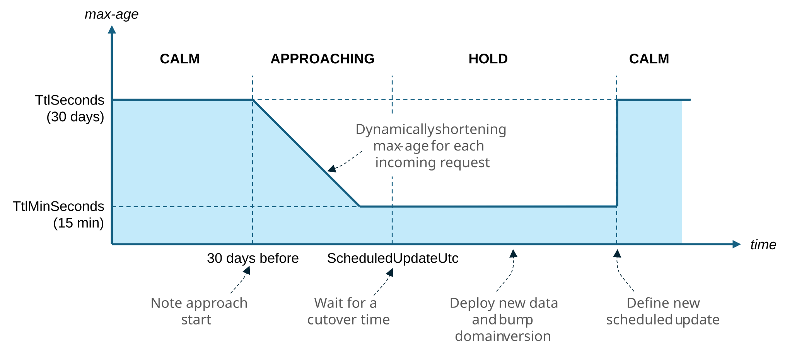

# Client Cache Schedule

> **Guide path:** [Topologies](topologies.md) → **Client Cache Schedule** → [Operations](operations.md) · [Guide index](README.md)

Long-lived public datasets create a client-caching dilemma. A 30-day browser or CDN TTL saves substantial bandwidth, but a client that receives that TTL one day before a planned release can keep the old generation for weeks.

**Client Cache Schedule** lets a snapshot domain keep a long client `max-age` while the cutover is far away, then gradually shorten it as the scheduled time approaches.

It changes only the client-facing `Cache-Control` header. It does not change Output Cache TTL, Data Cache TTL, server entries, or the domain `Version`.

## Follow one response toward cutover

Suppose a public tile domain normally gives clients a 30-day TTL, with a 15-minute floor near a September release.

```text
Far from release                           Scheduled update
      Calm               Approaching             Hold
 max-age=30 days    max-age moves downward    max-age=15 min
───────────────┬───────────────────────────┬──────────────────► time
               │                           │
      30 days before                 cutover time
```



Each response is assigned one phase:

| Phase | When | Client header behaviour |
|-------|------|-------------------------|
| **Calm** | Time until cutover is at least `TtlSeconds` | Use the full `TtlSeconds` |
| **Approaching** | Inside that window but before cutover | Shorten `max-age` linearly toward `TtlMinSeconds` |
| **Hold** | Scheduled time has arrived or passed | Stay at `TtlMinSeconds` until the schedule changes |
| **NotApplicable** | No schedule, Client Cache blocked, or `NoStore` | Use the normal constant header or `no-store` |

During most of the Approaching phase, `max-age` roughly follows the time remaining. Once the cutover is closer than the configured floor, clients still receive the floor value. The floor deliberately trades an exact cutover boundary for a minimum practical cache lifetime.

The exact clamps and rounding rules are documented in the [Client Cache Schedule algorithm](../reference/client-cache-schedule-algorithm.md).

## Configure the client policy

The schedule belongs under the domain's `ClientCache` section:

```json
{
  "Cache": {
    "Domains": {
      "maps-satellite": {
        "Version": "2030-11",
        "DataCache": {
          "TtlSeconds": 3600
        },
        "OutputCache": {
          "TtlSeconds": 300
        },
        "ClientCache": {
          "Cacheability": "Public",
          "TtlSeconds": 2592000,
          "TtlMinSeconds": 900,
          "ScheduledUpdateUtc": "2030-12-01T00:00:00Z",
          "MustRevalidateNearUpdate": true
        }
      }
    }
  }
}
```

The settings mean:

- clients may cache for 30 days during Calm;
- the ramp begins 30 days before the scheduled time;
- the client TTL never falls below 15 minutes;
- `must-revalidate` is added at the floor and during Hold;
- Output Cache continues using a 5-minute TTL, while Data Cache continues using a 1-hour TTL.

| Setting | Purpose |
|---------|---------|
| `Cacheability` | `Public`, `Private`, or `NoStore`; `NoStore` makes the schedule inapplicable |
| `TtlSeconds` | Full client `max-age` and the length of the approach window |
| `TtlMinSeconds` | Minimum client `max-age` near and after cutover |
| `ScheduledUpdateUtc` | Planned cutover in UTC; omit it for a constant client TTL |
| `MustRevalidateNearUpdate` | Add `must-revalidate` at the floor and during Hold |

Configuration durations are integer seconds. If the minimum exceeds the maximum, it is clamped to the maximum. Equal values produce no visible ramp.

Set `TtlSeconds` to `0` when clients must revalidate every response: CacheOrchestrator emits `max-age=0` and the schedule is not applicable. A positive `TtlSeconds` may use `TtlMinSeconds: 0` to ramp all the way down to immediate revalidation at cutover.

## Understand what the schedule does not do

Client Cache Schedule does not:

- publish the new dataset;
- prewarm Output Cache or Data Cache entries;
- change the domain `Version`;
- invalidate server entries;
- purge a browser or CDN cache;
- coordinate deployment across application instances.

It prepares clients to ask again more frequently near a known date. Your release process still owns the data cutover and generation change.

This distinction matters because a scheduled header and a version bump solve opposite sides of the boundary:

```text
Before cutover: schedule shortens how long clients keep the old generation
At cutover:     Version moves new server requests to the new generation
After cutover:  next schedule restores the long Calm period
```

## Run a planned cutover

### Before the release

1. Set `ScheduledUpdateUtc` at least one full `TtlSeconds` window ahead when possible.
2. Keep `TtlSeconds` large enough to deliver the bandwidth benefit during Calm.
3. Pick the largest `TtlMinSeconds` that still meets the recovery target near release.
4. Monitor `phase=approaching` and the resulting origin traffic before go-live.

Changing the schedule too late cannot affect clients that are already holding a response under an earlier long TTL.

### At the release

1. Make the new snapshot available to every application instance.
2. Change the domain `Version` so new requests use the new generation.
3. Set the next `ScheduledUpdateUtc`, or clear it if the next date is unknown.
4. Verify responses, cache diagnostics, and origin load.

Keep the old schedule temporarily if you want the domain to remain in Hold during deployment verification. Set the next future schedule when it is safe to resume the long client TTL.

### After the release

The next future schedule returns responses to Calm. A cleared schedule returns the normal constant `TtlSeconds` with phase `n/a`.

Old server entries remain in the old versioned key space until their store TTL removes them. Old client responses age according to the headers they received before the cutover.

## Choose values from the release objective

| Question | Setting it influences |
|----------|-----------------------|
| How long may public clients keep data during normal operation? | `TtlSeconds` |
| How quickly should clients retry around a delayed or failed release? | `TtlMinSeconds` |
| When does the approach window begin? | Also `TtlSeconds` |
| Must stale responses be revalidated at the floor? | `MustRevalidateNearUpdate` |
| Is the content truly shared across users? | `Cacheability` and auth/vary policy |

A common starting shape for large public assets is a long client TTL, a shorter server Output Cache TTL, and an independent Data Cache TTL. There is no requirement that the three values match.

Avoid scheduling highly dynamic CRUD data simply to compensate for missing invalidation. Use entity invalidation and an appropriate short client policy for that profile.

## Observe the phase

On domain responses, `X-Cache` includes:

```http
X-Cache: domain=maps-satellite; ...; phase=approaching; ...
```

The `cache_orchestrator.client.schedule` metric carries `domain` and `phase` tags. Use it to confirm the transition and anticipate the increase in requests as client TTLs shorten.

The phase reports which branch generated the current header. It does not prove that every client received that header or that a CDN obeyed it.

See [Observability](../reference/observability.md) for the full header and metric reference.

## Handle unscheduled updates separately

If no reliable date exists, omit `ScheduledUpdateUtc`. Clients receive the constant `TtlSeconds`, and server freshness continues to use TTL, tag invalidation, or `Version` according to the domain profile.

For an emergency snapshot release, change `Version` to protect new server requests and purge any CDN through its own control plane if required. Clients already holding a response can remain stale until their current `max-age` ends; a schedule added at emergency time cannot retroactively shorten it.

Next: learn how to inspect and safely change a running deployment in [Operations](operations.md).
