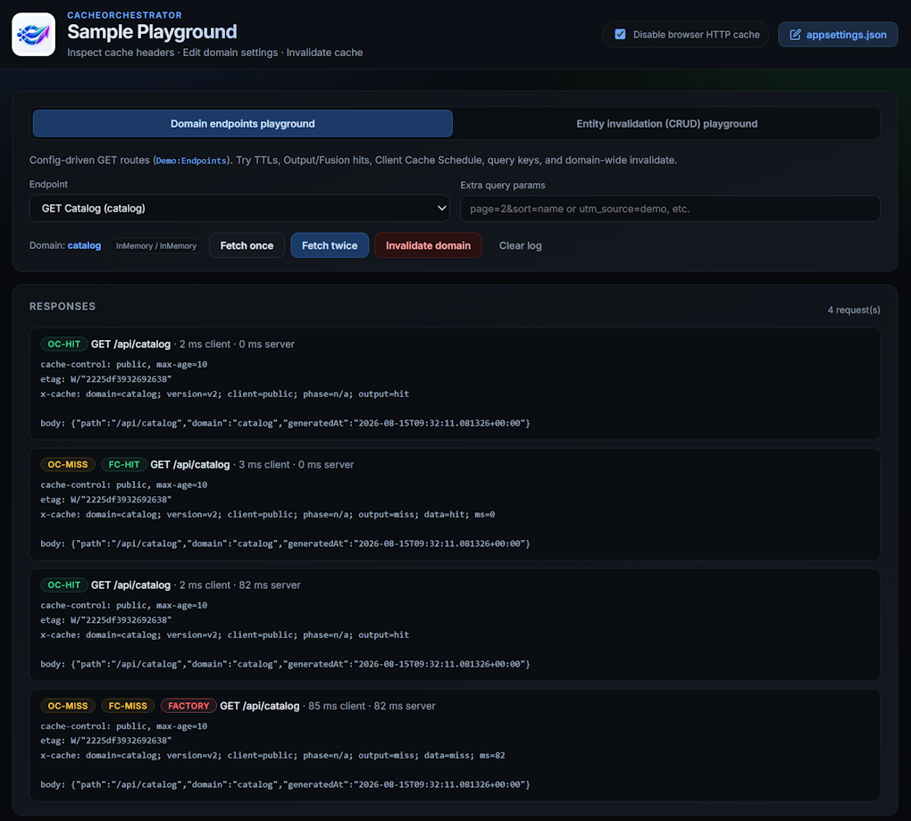

# CacheOrchestrator Sample Playground

A playground for CacheOrchestrator after the [Minimal sample](../CacheOrchestrator.Minimal). You get a browser UI to change TTLs, watch Client Cache Schedule phases, try Redis and multi-instance labs, and experiment with entity invalidation — without writing a new project.


---

## Choose your path

| Path | Best for |
|------|----------|
| **A. Solo (host)** | Fastest loop; settings editor; single process. See below. |
| **B. Topology labs (Docker)** | Learn **cache layouts** + Admin + Redis with one command. See [labs/README.md](labs/README.md)|

---

## Solo (host)

```bash
dotnet run --project samples/CacheOrchestrator.Sample
```

Open the printed URL (http://localhost:5289 by default).

**Disable browser HTTP cache** (header, next to **appsettings.json**, **on by default**) sets Fetch **`cache: 'no-store'`** so the browser always calls the app and you see **server** OC/FC hits. It does **not** send HTTP `Cache-Control: no-store` and does **not** turn off Output/Fusion on the server. Uncheck only to demo client `max-age` / BROWSER-CACHE.

This playground can write `appsettings.json` from the browser. That is for this sample only.

## What to try

- **Domain endpoints** panel: `Demo:Endpoints` from config (catalog, product, search, …). Add a line under `Demo:Endpoints` and restart (or save config) to expose another route.
- **Entity invalidation (CRUD)** panel: fixed `GET /api/crud/products/42` + **Update price (PUT)** — separate from the domain dropdown.
- **appsettings.json** (top right) opens an editor. Change a Version or TTL, save, and the process reloads configuration so the **next request** uses the new settings. That does **not** purge cache — use **Invalidate domain** (or entity) when you want a separate invalidation.
- **Client Cache Schedule.** Set `ScheduledUpdateUtc` on a domain and watch the phase on each fetch:
  - **calm** — far from the cutover; client `max-age` is at its maximum
  - **approaching** — `max-age` falls toward the floor
  - **hold** — the scheduled time has passed; `max-age` stays at the floor
- **Disable browser HTTP cache** (header, default on) — bypass browser cache only; uncheck to demo BROWSER-CACHE.
- **Badges** on a response:
  - **BROWSER-CACHE** — client cache served the response (only when **Disable browser HTTP cache** is off)
  - **OC-HIT** — Output Cache served the HTTP response
  - **OC-MISS FC-HIT** — handler ran; FusionCache had the object
  - **OC-MISS FC-STALE** — fail-safe stale from Fusion
  - **OC-MISS FC-MISS FACTORY** — both layers missed; Fusion factory ran (not a “hit”)
- **Extra query params** (optional): e.g. `page=2` usually creates a **different** cache key. Tracking params such as `utm_source=demo` are omitted from keys (same entry as without them) — see [cache-keys.md](../../docs/cache-keys.md).

## CRUD (entity invalidation)

In the playground, open the **Entity invalidation (CRUD)** panel (not the domain endpoint list).

- **Invalidate entity** — purge OC/FC for `products/42` only (in-memory price unchanged).
- **Update price (PUT)** — enter a price, write store + entity invalidate → next Fetch shows that price.

Suggested UI flow: Fetch → Fetch twice (OC-HIT) → Invalidate entity → Fetch (FACTORY, same price) → set Price → Update price → Fetch (FACTORY, new price).

```bash
curl -i http://localhost:5289/api/crud/products/42

curl -i -X PUT http://localhost:5289/api/crud/products/42 \
  -H "Content-Type: application/json" \
  -d "{\"name\":\"Demo Widget\",\"price\":12.5}"

curl -i http://localhost:5289/api/crud/products/42
```

`GET /api/crud/products` (list) is an uncached store dump — curl only. Background: [domain-profiles.md](../../docs/domain-profiles.md).

## Next

- [labs/README.md](labs/README.md) — topology labs 01–05 (main learning path for multi-instance cache)
- [Getting started](../../docs/getting-started.md)
- [Client Cache Schedule](../../docs/client-cache-schedule.md)
- [Deployment](../../docs/deployment.md) · [Cluster bus](../../docs/cluster-bus.md)
