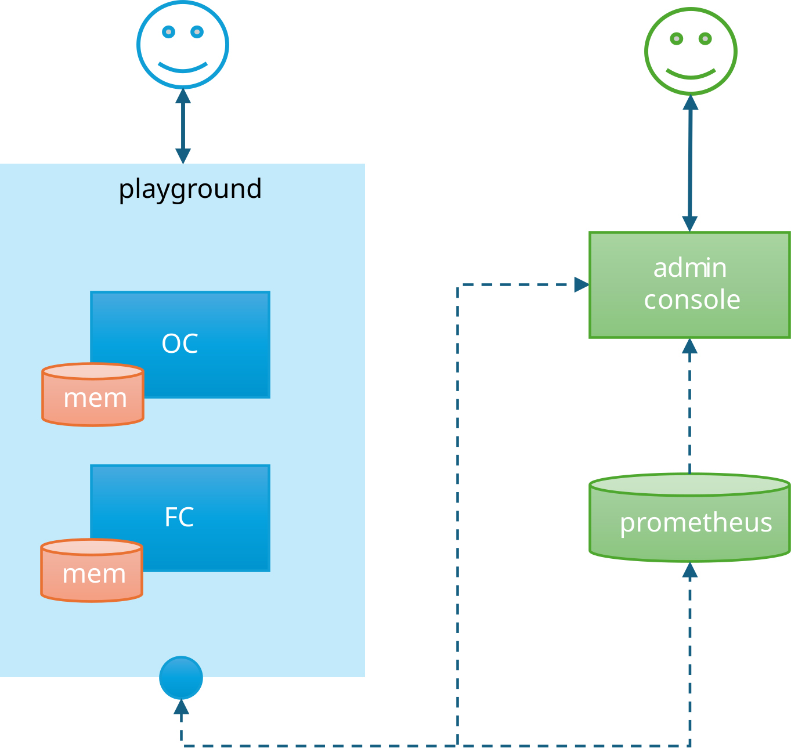
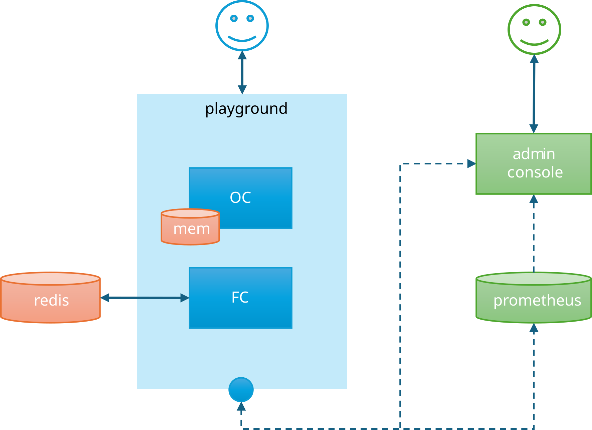
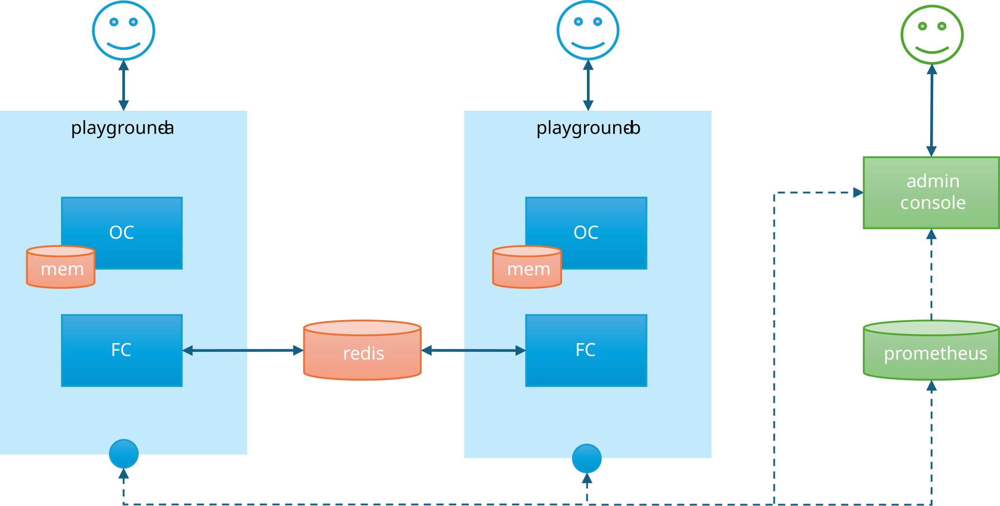
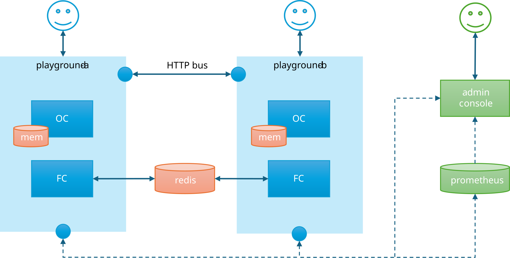
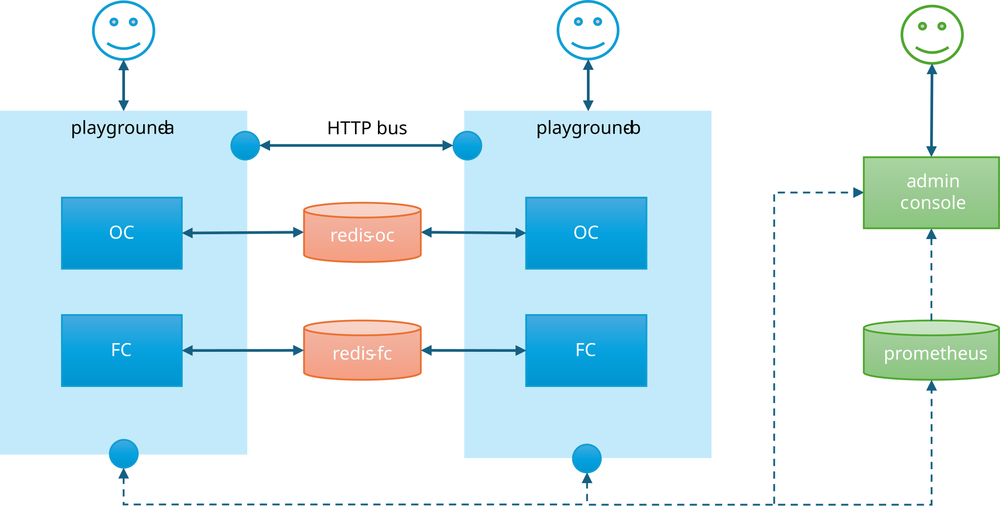

# Playground topology labs (Docker Compose)

> **Guide (learn by running).** Orientation: [Guide — topologies](../../../docs/guide/topologies.md). Product overview: [root README](../../../README.md). Production wiring: [deployment.md](../../../docs/deployment.md).

These numbered **Compose stacks** run the **Playground sample** together with Prometheus, Admin Console, Redis, single or multiple app instances, and the cluster bus. Use them to learn how cache layers fit together and how CacheOrchestrator ties them to domain model using simple configuration.

For a single process on your machine without Docker, use the [Playground sample](../README.md) alone.

| Stage | Compose file | Stack |
|-------|----------------|--------|
| **01** | [`compose/01-observability.yml`](compose/01-observability.yml) | Playground + Prometheus + Admin Console (InMemory) |
| **02** | [`compose/02-redis.yml`](compose/02-redis.yml) | Stage 01 + Redis as Fusion **L2** |
| **03** | [`compose/03-multi.yml`](compose/03-multi.yml) | **Two** playgrounds + shared Redis L2 |
| **04** | [`compose/04-bus.yml`](compose/04-bus.yml) | Stage 03 + **HTTP cluster bus** |
| **05** | [`compose/05-dual-redis-bus.yml`](compose/05-dual-redis-bus.yml) | **Two Redis** (OC store vs Fusion L2/backplane) + bus |

---

## Experiment (this is the point)

Each lab gives you a **running playground** (and Admin Console + Prometheus). Treat it as a sandpit:

1. Open the **Playground** UI and pick a domain endpoint (catalog, product, search, CRUD, …).  
2. Click **Fetch** more than once — watch badges and `X-Cache` (OC-HIT, DC-HIT, FACTORY, schedule phase, …).  
3. Open **appsettings** in the UI, change a TTL, Version, or Client Cache Schedule value, save, then fetch again.  
4. Open **Admin Console** — Overview, Domains, Hints, Metrics — and relate numbers to what you just did.  
5. Move to the **next stage** when you want Redis, a second node, or the bus; the playground behaviour stays familiar, the **topology** changes.

There is no single “correct” click path. Change settings, invalidate, compare two URLs, then look at Admin Console. That loop is how the domain model becomes concrete.

**TTLs are playground-tuned on purpose.** Domain values are shorter than production so you can **see expiry at each layer** without waiting minutes. They are still long enough to fetch a few times, read badges, and think. Domains differ by intent (e.g. **search** is the shortest; **product-detail** / **product-crud** stay warmer so multi-step flows work). Open **appsettings** → `Cache:Domains` to inspect or change them.

If behaviour looks surprising, see **[Troubleshooting](#troubleshooting)** (browser cache toggle, TTLs, keys, multi-instance gaps, …).

---

## Stage 01 — Observability

**Stack:** `playground` · `prometheus` · `admin`. OC InMemory · FC InMemory



<br>

**Cache config:**
```json
{
  "Cache": {
    "OutputCache": { "Provider": "InMemory" },
    "DataCacheInstances": {
      "default": { "Provider": "InMemory" }
    },
    "Cluster": {
      "Bus": { "Enabled": false }
    }
  }
}
```

**Compose:** `compose/01-observability.yml`  

```bash
docker compose -f samples/CacheOrchestrator.Sample/labs/compose/01-observability.yml up --build
```

| URL | |
|-----|--|
| Playground | http://localhost:5289 |
| Admin Console | http://localhost:5188 |

### In this stage

One app process with full **ops surface**: Admin API (health, config, invalidate; optional process-lifetime `/stats`), Prometheus (`/metrics` from the `CacheOrchestrator` meter), Admin Console (dashboard / fan-out / **Prom-only** stats & hints / impact). Caching itself is still InMemory — observability does not change how OC/FC store data. Rebuild images after library changes (`docker compose … up --build`) so Console and playground pick up OTEL instruments and window-stats BFF.

→ [observability.md](../../../docs/observability.md) · [admin.md](../../../docs/admin.md)

### When this layout fits

- Single instance (or first cloud deploy)  
- You want hit rates, factory share, schedule phase visibility  
- You are not ready for Redis

### What to try

1. Fetch until hits and misses are clear  
2. Shorten a domain TTL, save, fetch again  
3. Admin → **Overview** / **Hints** / **Metrics** (scrape ~5s)  

### Limits

- Cache dies with the process  
- A second replica would not see this process’s OC/FC entries  

---

## Stage 02 — Redis as Fusion L2

**Stack:** Stage 01 + `redis`. OC InMemory · FC **Redis** (L2 + backplane on that Redis).



<br>

**Cache config:**
```json
{
  "Cache": {
    "OutputCache": { "Provider": "InMemory" },
    "DataCacheInstances": {
      "default": { "Provider": "Redis" }
    },
    "Redis": {
      "Configuration": "redis:6379"
    },
    "Cluster": {
      "Bus": { "Enabled": false }
    }
  }
}
```

**Compose:** `compose/02-redis.yml`  

```bash
docker compose -f samples/CacheOrchestrator.Sample/labs/compose/02-redis.yml up --build
```

| URL | |
|-----|--|
| Playground | http://localhost:5289 |
| Admin Console | http://localhost:5188 |

### In this stage

**L2** = Redis for Fusion objects (survives restart / later multi-node). OC stays InMemory on purpose — layers can use different providers. With one instance the backplane is quiet; registration already matches multi-node (Stage 03).

→ [backends.md](../../../docs/backends.md) · [data-cache.md](../../../docs/data-cache.md)

### When this layout fits

- You can lose HTTP response cache on recycle, but not expensive object rebuilds  
- Preparing for a second replica without running two apps yet  

### What to try

1. Fetch until **DC-HIT** / factory quiet  
2. `docker compose … restart playground`  
3. Fetch again — Fusion may hit **L2** without a factory  
4. Tweak Fusion soft/hard TTL; compare Admin metrics before/after restart  

### Limits

- Still one app process  
- OC is not shared (by design here)  

---

## Stage 03 — Two playgrounds + shared Redis L2

**Stack:** `playground-a`, `playground-b`, `redis`, `prometheus`, `admin`. OC InMemory per process · FC Redis shared.



<br>

**Cache config:**
```json
{
  "Cache": {
    "OutputCache": { "Provider": "InMemory" },
    "DataCacheInstances": {
      "default": { "Provider": "Redis" }
    },
    "Redis": {
      "Configuration": "redis:6379"
    },
    "Cluster": {
      "Bus": { "Enabled": false }
    }
  }
}
```

**Compose:** `compose/03-multi.yml`  

```bash
docker compose -f samples/CacheOrchestrator.Sample/labs/compose/03-multi.yml up --build
```

| URL | |
|-----|--|
| Playground A | http://localhost:5289 |
| Playground B | http://localhost:5290 |
| Admin Console | http://localhost:5188 (both instances listed) |

### In this stage

Two processes, one Redis L2. **Shared:** Fusion L2 objects + Fusion **backplane** (L1 invalidation). **Not shared:** InMemory OC bodies and process-local overlays.

**Bus is off on purpose.** Redis L2 + backplane ≠ full multi-node consistency:

| After invalidate on A | On B |
|-----------------------|------|
| **Fusion** | L1 cleared via backplane; refill from L2 (or factory if L2 purged) |
| **Output Cache (InMemory)** | **Not** cleared — B can still **OC-HIT** the old body until OC TTL or invalidate **on B** |

That gap is real multi-instance behaviour with OC InMemory and no command bus. Stage **04** adds the bus; Stage **05** shares OC via Redis.

→ [deployment.md](../../../docs/deployment.md) · [cache-keys.md](../../../docs/cache-keys.md)

### When this layout fits

- Multiple replicas; shared object cache is the main win  
- HTTP cache can stay node-local (or short OC TTL / OC Redis later)  

### What to try

1. Warm on **A** past factory → same path on **B**: expect **OC-MISS**, **FC** from L2 (no second factory)  
2. Warm **both** so each has its own OC entry  
3. Invalidate on A only → fetch **B**: often still **OC-HIT** (stale OC body)  
4. Admin **Instances** — two rows; change TTL on A’s UI → both nodes load shared policy  
5. When you want OC cleared on every node too → **Stage 04**  

### Limits

- **No bus** — process-local OC / Version / TTL overlays not pushed to peers (see **04**)  
- OC not shared across nodes (see **05**)  

---

## Stage 04 — Cluster bus

**Stack:** Stage 03 + **`Cache:Cluster:Bus` enabled** (static peers)



<br>

**Cache config:**
```json
{
  "Cache": {
    "OutputCache": { "Provider": "InMemory" },
    "DataCacheInstances": {
      "default": { "Provider": "Redis" }
    },
    "Redis": {
      "Configuration": "redis:6379"
    },
    "Cluster": {
      "Bus": {
        "Enabled": true,
        "Membership": "Static",
        "ApiKey": "dev-admin-key",
        "Static": {
          "Instances": [
            { "Id": "playground-a", "Url": "http://playground-a:8080" },
            { "Id": "playground-b", "Url": "http://playground-b:8080" }
          ]
        }
      }
    }
  }
}
```

**Compose:** `compose/04-bus.yml`  

```bash
docker compose -f samples/CacheOrchestrator.Sample/labs/compose/04-bus.yml up --build
```

| URL | |
|-----|--|
| Playground A | http://localhost:5289 |
| Playground B | http://localhost:5290 |
| Admin Console | http://localhost:5188 (both instances listed) |

### In this stage

Redis L2 + backplane handle **data / Fusion L1**. The **bus** carries **commands** (invalidate, Version, TTL patch) — critical for process-local state such as InMemory OC and runtime overlays. 

→ [cluster-bus.md](../../../docs/cluster-bus.md) · [deployment.md](../../../docs/deployment.md)

### When this layout fits

- Several instances with InMemory OC or local overlays  
- Admin Console bus-distribute mode  
- Policy actions must hit **all** nodes immediately  

### What to try

1. Admin → Operations / distribution (bus capability)  
2. Invalidate or Version with distribute → both A and B  
3. Compare badges before/after; contrast Stage 03 (no bus)  

### Limits

- Still one Redis for Fusion  
- OC still InMemory (shared OC → Stage **05**)  

---

## Stage 05 — OC Redis + FC Redis + Cluster bus 

**Stack:** 2× playground · **redis-oc** · **redis-fc** · bus · prometheus · admin.



<br>

**Cache config:**
```json
{
  "Cache": {
    "OutputCache": {
      "Provider": "Redis",
      "Redis": { "Configuration": "redis-oc:6379" }
    },
    "DataCacheInstances": {
      "default": {
        "Provider": "Redis",
        "Redis": { "Configuration": "redis-fc:6379" }
      }
    },
    "Cluster": {
      "Bus": {
        "Enabled": true,
        "Membership": "Static",
        "ApiKey": "dev-admin-key",
        "Static": {
          "Instances": [
            { "Id": "playground-a", "Url": "http://playground-a:8080" },
            { "Id": "playground-b", "Url": "http://playground-b:8080" }
          ]
        }
      }
    }
  }
}
```

**Compose:** `compose/05-dual-redis-bus.yml`  

```bash
docker compose -f samples/CacheOrchestrator.Sample/labs/compose/05-dual-redis-bus.yml up --build
```

| URL | |
|-----|--|
| Playground A | http://localhost:5289 |
| Playground B | http://localhost:5290 |
| Admin Console | http://localhost:5188 (both instances listed) |

| Redis service | Role in this lab |
|---------------|------------------|
| **redis-oc** | Output Cache **distributed store** (shared HTTP responses) |
| **redis-fc** | Fusion **L2** + **backplane** |

### In this stage

| Concern | Mechanism |
|---------|-----------|
| Share **full responses** | OC Redis → `redis-oc` |
| Share **objects** / skip factory | FC L2 → `redis-fc` |
| Drop remote **L1** | Fusion backplane on `redis-fc` |
| Apply **commands** everywhere | HTTP bus |
| Operate | Admin Console + Prometheus |

Shared OC store ≠ bus: Redis OC shares **payloads**; the bus still distributes **commands** (Version/TTL overlays, Admin distribute, other process-local state). Two Redis instances in the lab so you **see** separate roles — production may use one Redis (keys/DBs) or two (isolation). Per-layer connection strings: `OutputCache:Redis` vs `DataCacheInstances:…:Redis`.

Host/port vary is off in multi-instance labs (same note as Stage 03).

→ [deployment.md](../../../docs/deployment.md) · [backends.md](../../../docs/backends.md) · [cluster-bus.md](../../../docs/cluster-bus.md)

### When this layout fits

- Multiple web nodes with shared HTTP + object cache  
- Fast L1 invalidation + consistent commands  

### What to try

1. Warm on A until **OC-HIT** → same route on B → **OC-HIT** from shared Redis  
2. Invalidate; both nodes stay coherent  
3. Admin distribute / bus for Version or domain invalidate  
4. Optional: `redis-cli` on host **6380** (OC) vs **6381** (FC)  

### Limits

- One region / one compose network  
- Topology teaching, not HA Redis ops  

---

## Lab vs production

These stacks are **teaching environments**, not blueprints for a production edge. Real multi-instance setups usually look different around the apps:

| In production (typical) | In these labs (on purpose) |
|-------------------------|----------------------------|
| Reverse proxy / load balancer (HAProxy, nginx, cloud LB) in front of several identical nodes | **No proxy** — each playground is published on its **own host port** |
| One public URL; you rarely care which instance handled the request | Open **A** and **B** in separate browser tabs (`:5289` / `:5290`) so you can **see each instance alone** (hits, factory, local L1) |
| TLS, auth at the edge, private networks | Plain HTTP on localhost |
| Managed Redis, HA, monitoring as a platform concern | Single-container Redis (or two) for clarity |
| **Same cache policy on every node** (shared config / ConfigMap / vault, rolling deploy) | Stages **03–05**: both nodes share one Docker **named volume** (`/shared/appsettings.json`, seeded from `appsettings.seed.json`); entrypoint symlinks it to `/app/appsettings.json`. **Instance id** stays per process (`Cache__InstanceId`) |
| Config change process is controlled (pipeline, not two writers racing a JSON file) | Lab volume is shared RW — fine for demos; last save wins if you edit A and B at once |

**Why separate browser URLs for each instance?**  
With a load balancer you would not know which process answered. Here the goal is to compare **playground-a** vs **playground-b** side by side: warm A, fetch B, invalidate on one side, watch Admin rows per `instance_id`. That is harder if traffic is round-robined through one URL.

**Why shared settings on multi-instance labs?**  
In production you must not run different TTLs or Versions on different replicas of the same app. The lab keeps **one shared policy file** so a UI save on A is what B loads too. On stages **03–05** a Docker **named volume** holds that file (seeded from `config/0N/appsettings.seed.json`); both playgrounds use it, the peer reloads within about a second after Save. Topology (Redis, bus, providers) stays in read-only `playground.Production.json`.

Reset policy to seed: `docker compose -f …/0N-….yml down -v` then `up` again.  
Normal rebuild (keep edited policy): `docker compose -f …/0N-….yml up --build -d` — no `-v`.

Other simplifications exist for the same reason: **focus on cache behaviour** (OC / Fusion / client headers, backplane, bus, Admin). The labs omit production-grade networking, certificate management, auto-scaling, and hardened Redis. After the cache story is clear, map the same ideas onto your real proxy, cluster, and ops stack — CacheOrchestrator’s domain model does not require the lab’s simplified front door.

---

## Troubleshooting

| Symptom | Check |
|---------|--------|
| Admin instance Down | Playground healthy? ApiKey `dev-admin-key`? |
| Metrics empty | Traffic generated? Wait ~5–10s scrape; Prometheus targets UP? |
| Redis connection errors | Stage config uses service name `redis` / `redis-oc` / `redis-fc`, not `localhost` inside containers |
| Settings back to defaults after `down` (stages 01–02) | Expected for single-node labs |
| Multi-lab settings still changed after `down` (no `-v`) | Named volume keeps policy — use `down -v` then `up` to re-seed from `appsettings.seed.json` |
| `Error response from daemon: open /var/lib/docker/tmp/...` on `up --build` | Old compose used a **volume file subpath** mount (fragile on Docker Desktop). Current labs mount `/shared` as a directory + entrypoint symlink. Pull latest compose/Dockerfile; one-time `down -v` if an old broken mount is stuck, then `up --build -d`. |
| Bus not distributing | Stages 04–05 only; peers use Docker DNS URLs in lab config |
| No **BROWSER-CACHE**, or always server hits | Header toggle **Disable browser HTTP cache** is **on by default** (for server OC/FC demos). Uncheck only when you want client `max-age` / BROWSER-CACHE. |
| OC-HIT then sudden MISS / FACTORY | Domain **TTL** expired — check `OutputCache.TtlSeconds` vs `DataCache.TtlSeconds` / `fusionCache.hardTtlSeconds` for that domain in `Cache:Domains` |
| Always FACTORY, never hits | Domain disabled? Wrong endpoint/domain? Keys differ (query, host — multi-lab keys note in Stage 03)? |
| Client headers not what you expect | `ClientCache.TtlSeconds` / schedule / **Disable browser HTTP cache** (Fetch uses `no-store` when on) |
| A vs B disagree | Topology (bus off, OC InMemory local) — not a TTL bug; see Stages 03–05 |
| appsettings Save: `cat` in container is new, HTTP GET / UI still old | Output Cache **base policy** was caching `/api/demo/appsettings`. Fixed with `NoStore` on demo control routes — rebuild playground image. |
| A Save applies on A; B settings UI shows new JSON but Fetch still old Version/TTL | B reads the file for the editor, but runtime options need a config **reload**. Sample polls the shared volume (~1s) and reloads; rebuild playground image. Stage 03 has no bus — file share + poll is intentional. |

---

## Where to read more

Labs stay short on purpose: stages cover **topology**; use the sample README and technical docs for **how a feature works**.

| Topic | Start here |
|-------|------------|
| Playground UI, badges, CRUD, Client Cache Schedule, host `dotnet run` | [Sample README](../README.md) |
| Which layout / package | [Guide — topologies](../../../docs/guide/topologies.md) |
| Docs index (getting started, config, OC/FC, invalidation, ops) | [docs/README.md](../../../docs/README.md) |
| Product overview | [root README](../../../README.md) |
| Deployment / multi-instance / Redis / bus | [deployment.md](../../../docs/deployment.md), [cluster-bus.md](../../../docs/cluster-bus.md) |
| Admin API + Admin Console | [admin.md](../../../docs/admin.md) · [Guide — operations](../../../docs/guide/operations.md) |
| Observability (`X-Cache`, metrics) | [observability.md](../../../docs/observability.md) |
| Cache keys (host/port vary, query params) | [cache-keys.md](../../../docs/cache-keys.md) |

