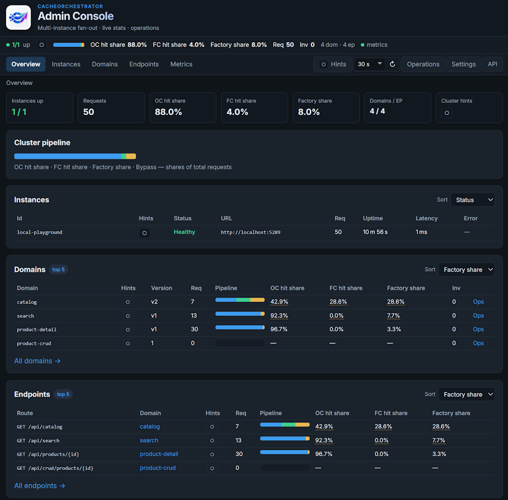

# CacheOrchestrator.AdminConsole

Admin Console App for multi-instance CacheOrchestrator: live stats, domain settings, invalidation, Version/TTL, **time-series Metrics**, and **recommendation Hints**.



It calls the **Admin API** on each instance you list (`Cache:Admin:Enabled`, `MapCacheOrchestratorAdmin`).

**Stats (Prom-only):** Console **2.2+** traffic KPIs, domain/endpoint tables, impact, and hints come from **Prometheus** (`AdminConsole:Metrics` + `GET /api/stats/window`). Local Admin API is used for health, domain config, and operations (invalidate / Version / TTL) only. Instance process-lifetime `GET …/stats` remains for diagnostics but is **not** used by the stats UI.

**Impact / charts:** Need Prometheus scrape of the `CacheOrchestrator` meter (e.g. `cache_orchestrator.fc.requests`, `cache_orchestrator.factory.duration`). Without Metrics store, statistics and charts are unavailable.

This host is **not** a NuGet package. It targets **.NET 10** only.  
Monitored app instances may still run on **.NET 8** or **.NET 10** — Admin talks **HTTP only**, so Admin TFM does not need to match instance TFMs.

| Guide | |
|-------|--|
| This README | Run / configure this host |
| **[deploy/admin/README.md](../../deploy/admin/README.md)** | **Docker image, volumes, custom hints, logs** |
| **[hints/README.md](hints/README.md)** | **How to write and add custom hint rules** (ships next to the rule packs) |
| [docs/admin.md](../../docs/admin.md) | Architecture, security, Metrics store |
| [docs/admin-hints.md](../../docs/admin-hints.md) | Repo overview of the hints feature |

---

## Enable the Admin API on each instance

```json
"Cache": {
  "InstanceId": "app-1",
  "Admin": {
    "Enabled": true,
    "ApiKey": "dev-admin-key"
  }
}
```

```csharp
app.MapCacheOrchestratorAdmin();
```

---

## Configure this host

```json
{
  "AdminConsole": {
    "ApiKey": "dev-admin-key",
    "RequestTimeoutMs": 3000,
    "Parallelism": 8,
    "LocalPathPrefix": "/cache-admin/local",
    "Instances": [
      { "id": "app-1", "url": "http://localhost:5290" },
      { "id": "app-2", "url": "http://localhost:5291" }
    ],
    "Metrics": {
      "Enabled": true,
      "Provider": "Prometheus",
      "BaseUrl": "http://localhost:9090"
    },
    "Hints": {
      "RuleFiles": [ "hints/*.json" ],
      "DisabledStatePath": "hints/disabled.local.json"
    }
  }
}
```

- **ApiKey** is sent as `X-Cache-Admin-Key` (must match each instance).  
- **Instances[].url** is the application base URL only.  
- **LocalPathPrefix** must match `Cache:Admin:RoutePrefix`.  
- **Restart required** after changing `Instances`, `ApiKey`, timeouts, or `Metrics` (bound via `IOptions` snapshot). Hint packs (`Hints`) reload without restart.  
- Production keys belong in a secret store; put VPN/SSO in front of this host.  
- Invalidate / Version / TTL change live cache state — see [docs/admin.md — Security](../../docs/admin.md#security).

### Defaults by environment

| Environment | Instances / Metrics | Custom hints | Disabled file |
|-------------|---------------------|--------------|---------------|
| **Development** (`dotnet run`) | Playground `:5289`, Metrics on | `hints/*.json` | `hints/disabled.local.json` |
| **Production** / Docker image | Empty (you configure) | `data/rules/*.json` | `data/disabled.local.json` |

Product pack **`hints/core-hints.json` is always loaded** in every environment.

---

## Run (local)

```bash
dotnet run --project src/CacheOrchestrator.AdminConsole

# Publish
dotnet publish src/CacheOrchestrator.AdminConsole -c Release -o ./publish/admin
```

Requires a **.NET 10** runtime/SDK for this host.

- http://localhost:5188/ — UI  
- http://localhost:5188/health — process health  
- http://localhost:5188/scalar — OpenAPI UI (`MapOpenApi` + Scalar; `/scalar/v1` redirects here)

In Development, `Instances` point at the **Playground** sample (`:5289`), which also exposes `/metrics` for Prometheus.

**Pages:** Overview · Instances · Domains · Endpoints · **Metrics** · **Hints** · Operations · **Settings**

---

## Docker

Published image (GitHub Container Registry, on each GitHub Release):

```text
ghcr.io/amarinsek/cacheorchestrator-admin-console:<version>
```

**Operator volume** (recommended):

```text
/app/data/rules/*.json     ← drop custom hint packs (optional)
/app/data/disabled.local.json  ← Settings UI (survives restart if volume is RW)
```

Mount your instance list as `appsettings.Production.json` (or use env vars). Full how-to, compose example, logging:

→ **[deploy/admin/README.md](../../deploy/admin/README.md)**

```bash
# Build from repo root
docker build -f src/CacheOrchestrator.AdminConsole/Dockerfile -t cacheorchestrator-admin-console:local .

docker run --rm -p 5188:8080 \
  -e AdminConsole__ApiKey=dev-admin-key \
  -v "$PWD/deploy/admin/appsettings.example.json:/app/appsettings.Production.json:ro" \
  -v "$PWD/deploy/admin/data:/app/data" \
  cacheorchestrator-admin-console:local
```

Logs go to **stdout** (`docker logs`). No log agent is bundled in the image.

---

## Recommendation hints

The Admin Console App evaluates **read-only rules** against aggregated live stats (and domain config). Results appear as severity badges, the **Hints** page, and header chips.

| Capability | |
|------------|--|
| Product defaults | `hints/core-hints.json` (always loaded) |
| **Your rules (Development)** | Extra JSON under `hints/` via `RuleFiles` |
| **Your rules (Production/Docker)** | Drop packs under `data/rules/` (volume) |
| No recompile | Drop a file, **Settings → Reload** |
| Disable codes | Settings checkboxes, or `DisabledCodes` in config |
| Inspect a rule | Settings → click a row → JSON definition |
| Compile errors | Settings shows an **ERROR** card with rule code + path inside the rule |

**Customization is the normal path** for team thresholds and extra checks—prefer a pack such as `team-ops.json` over editing `core-hints.json` (cleaner product upgrades).

### Minimal custom pack

```json
{
  "name": "team-ops",
  "rules": [
    {
      "code": "team-high-factory",
      "severity": "Warning",
      "category": "Factory",
      "scope": "domain",
      "enabled": true,
      "when": {
        "all": [
          { "path": "domain.requests", "op": ">=", "value": 20 },
          { "path": "domain.fc.factoryShare", "op": ">=", "value": 0.30 }
        ]
      },
      "message": "Factory is {domain.fc.factoryShare:p1} on {domain.name}."
    }
  ]
}
```

- **Development:** save as `hints/team-ops.json` with `"RuleFiles": [ "hints/*.json" ]`.  
- **Docker:** save as `data/rules/team-ops.json` on the mounted volume.

Open **Settings**, confirm the group, then generate traffic and check **Hints**.

**Full operator handbook** (format, paths, ops, disable, design checklist):

→ **[hints/README.md](hints/README.md)**

Repo architecture notes: [docs/admin-hints.md](../../docs/admin-hints.md).

---

## Metrics (Prometheus)

```json
"AdminConsole": {
  "Metrics": {
    "Enabled": true,
    "Provider": "Prometheus",
    "BaseUrl": "http://localhost:9090"
  }
}
```

```bash
# Playground + Prometheus + Admin Console in one stack
docker compose -f samples/CacheOrchestrator.Sample/labs/compose/01-observability.yml up --build -d
```

Guide: [Playground topology labs](../../samples/CacheOrchestrator.Sample/labs/README.md) · [docs/admin.md](../../docs/admin.md).

---

## Further reading

- **[deploy/admin/README.md](../../deploy/admin/README.md)** — Docker / GHCR  
- [docs/admin.md](../../docs/admin.md) — fan-out, security, Metrics store  
- [docs/admin-hints.md](../../docs/admin-hints.md) — hints feature in the monorepo  
- **[hints/README.md](hints/README.md)** — writing custom rules  
- [docs/cluster-bus.md](../../docs/cluster-bus.md) — multi-instance bus  
